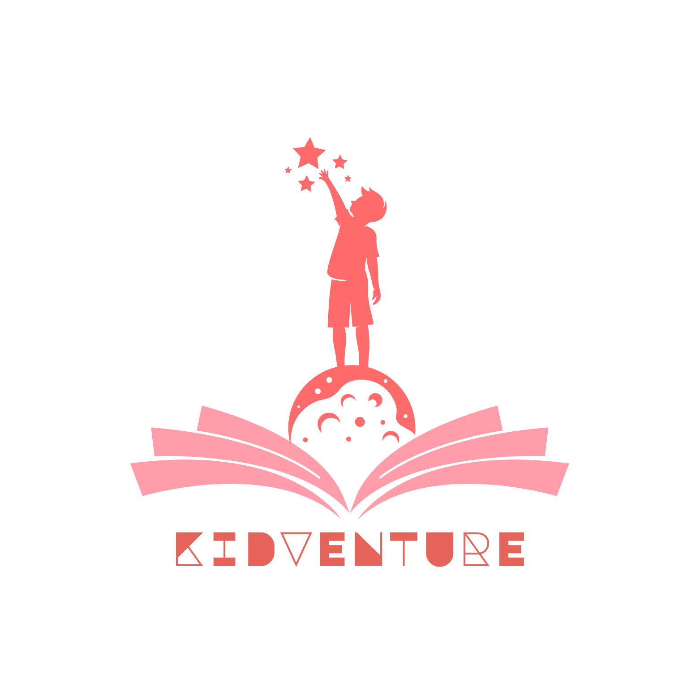

# Kidventure

Kidventure is an educational Flutter app designed for children aged 6-12. The app provides an engaging, interactive experience that makes learning fun through 3D models, AI-powered conversations, educational games, and more.



## 🌟 Features

### 🚀 Interactive Onboarding

Friendly introduction to the app's features with smooth transitions and engaging graphics.

### 🪐 3D Celestial Body Explorer

- Explore planets, stars, and other celestial bodies in immersive 3D
- Rotate, zoom, and interact with accurate 3D models
- Learn fascinating facts about space objects

### 🤖 AI-Powered Educational Chat

- Child-friendly AI assistant powered by Google Gemini
- Voice-to-text capability for easy interaction
- Safe, educational responses tailored for children
- Content filters to ensure age-appropriate information

### 📚 Educational Content

- Interactive learning modules
- Age-appropriate educational materials
- Engaging visualizations and animations

## 🛠️ Technologies

- **Flutter**: Cross-platform UI toolkit
- **Google Gemini AI**: Powering the intelligent chat assistant
- **Speech-to-Text**: For voice interaction capabilities
- **3D Model Rendering**: For interactive educational models
- **Lottie Animations**: For engaging visual elements

## 📥 Installation

1. Ensure you have Flutter installed on your machine
2. Clone this repository

   ```bash
   git clone https://github.com/your-username/kidventure.git
   ```

3. Navigate to the project directory

   ```bash
   cd kidventure
   ```

4. Install dependencies

   ```bash
   flutter pub get
   ```

5. Create a `secrets.dart` file in the `lib` directory with your Gemini API key:

   ```dart
   const String googleGeminiAPI = 'YOUR_API_KEY_HERE';
   ```

6. Run the app

   ```bash
   flutter run
   ```

## 🚀 Usage

1. Launch the app to view the onboarding screens
2. Navigate through different sections using the home screen
3. Explore 3D models of planets and celestial bodies
4. Chat with the AI assistant to learn new facts and get help
5. Explore various educational modules

## 🔒 Privacy & Safety

Kidventure is designed with children's safety in mind:

- No collection of personal information
- Child-friendly content filters
- Safe AI responses with appropriate content guidelines
- No external links or advertisements

## 👥 Contributors

- [Omar Hossam](https://github.com/OmarHossam666)

## 📄 License

This project is licensed under the [MIT License](LICENSE).

---

Made with ❤️ for curious young minds
